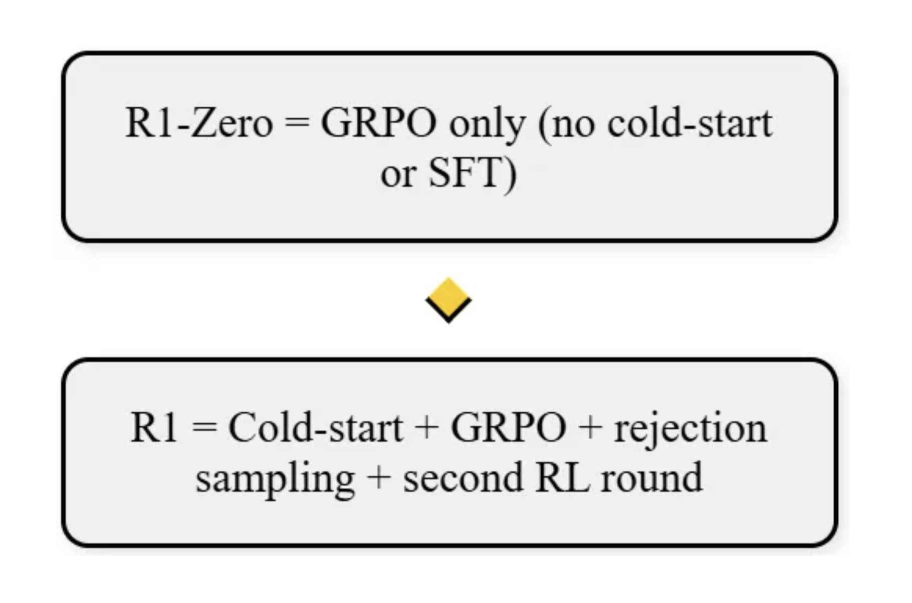

Across most popular open-source (OSS) models, there’s strong enthusiasm for climbing benchmark leaderboards. However, the majority of these benchmarks focus on pre-training performance — covering both reasoning and non-reasoning tasks.

In comparison, there has been relatively smaller attention given to OSS post-training, where most work has focused narrowly on improving instruction-following behavior.

That dynamic started to shift with the release of R1, which demonstrated the significant potential of large-scale, RL-driven post-training to meaningfully improve model capabilities. One line from the R1 technical report particularly stood out to me:

>"_**Post-training** can be a powerful lever for **boosting base model performance** while keeping **costs low**._"

Since I’ll be giving a talk to the team on R1 and GRPO, I wanted to capture a few quick reflections based on what I’ve learned so far.

## Group Relative Policy Optimization (GRPO)

Reward modeling is a core component of reinforcement learning (RL), as it defines the optimization direction of the entire process. Based on empirical experience, there are two fundamental principles for designing an effective reward model:

1. Accurately capture your true optimization objective

2. Ensure consistency in reward signals

The first principle can already be challenging — your reward model should provide a strong positive signal for preferred outputs (the "winners") and a weaker or negative signal for undesirable ones (the "losers"). You can think of this like designing the perspective of an impartial judge or having a "god view" over the task.

The second principle — consistency — becomes even more difficult, especially for non-reasoning tasks. Take conversational AI as an example: some users prefer short, concise answers, while others expect more detailed, descriptive responses. In such cases, the reward signal can become subjective and even contradictory, depending on the evaluator's preference. This inherent bias makes maintaining consistent reward signals particularly tricky in practice.

R1 series training adopts rule-based reward modeling, from it's paper, two reward training signals,
- Accuracy reward, for math/coding training data
- Format rewards, enforce model to put thinking process between think token \<think> .. \</think>

with this, defined a group based advantage as

$$
A_i = (r_i - mean({r_1, r_2, ..., r_G})) / std({r_1, r_2, ..., r_G})
$$

and plugged in training objective

$$
J_{GRPO}(\theta) = \mathbb{E}{[q \sim P(Q), \{o_i\}_{i=1}^G \sim \pi_{\theta_{old}}(Q|q)]} \left[ \frac{1}{G} \sum_{i=1}^{G} \left( \min \left( \frac{\pi_\theta(o_i|q)}{\pi_{\theta_{old}}(o_i|q)} A_i, \text{clip} \left( \frac{\pi_\theta(o_i|q)}{\pi_{\theta_{old}}(o_i|q)}, 1-\varepsilon, 1+\varepsilon \right) A_i \right) - \beta \mathbb{D}_{KL}(\pi_\theta || \pi_{ref}) \right) \right]
$$

where $r_i$ is the reward of output $o_i$. Intuitively, the GRPO update is comparing multiple answers to a single question within a batch. The model learns to become more like the answer marked as correct and less like the others. This is a very simple way to compare the advantage, which is the measure of how much better a specific action is than the average at a given state. Compared to PPO or generic RLs, GRPO can run wth a far higher number of samples per question/prompt.

*Diagram Ref https://arxiv.org/pdf/2402.03300*

Compared with PPO, it avoids learning value model which significant improved training efficiency and maintained a relatively clear/deterministic learning signal, specific
1. Training a good value model is challenging, where research hasn't established best practice
2. Reduced memory and compute resource due to remove value model

## Mandating Reflective Reasoning

For each question, requiring / enforcing a process where a model explicitly works through its thought process or reasoning steps before arriving at the final answer

*Ref:https://arxiv.org/pdf/2501.12948*

intuitively, with this think token, the completion of the model is trending longer along training steps. Behaviors such as **reflection** -- where the model revisits the reevaluates its previous steps -- and the exploration of alternative approaches to problem-solving arise spontaneously. **These behaviors are not explicitly programmed but instead emerge as a result of the model\'s interaction with the reinforcement learning environment**. 

*Ref:https://arxiv.org/pdf/2501.12948*

This spontaneous development significantly enhances Deepseek-R1-Zero's reasoning capabilities, enabling it to tackle more challenging tasks with greater efficiency and accuracy.

## Deepseek-R1: RL with Cold Start

Objective: enhance reasoning performance and readability by incorporating a small amount of high-quality **cold-start data**

I summarized this R1 workflow to demonstrate the training pipeline, blue rectangle stands for model checkpoint, the cylinder means dataset.

SFT (cold start data) -> RL (GRPO: rule-based + consistency reward) -> SFT (more diverse sft training data including both reasoning and none-reasoning) -> RL (GRPO: rule-based + preference reward)

Most of the components are pretty clear demnstrated in below diagram, one thing to explicitly mention is the second stage SFT data - it utilize the first RL convergence checkpoint to collect high-quality reasoning and non-reasoning data through **rejection sampling**,
- Reasoning data: 600k, filtered out CoT with mixed languages, long paragraphs and code blocks
- Non-reasoning data: 200k, a combination of subset of deepseek-v3 sft data plus CoT prompting data from deepseek-v3 sft(?) checkpoint, including writing, role-playing, factual QA, self-cognition and translation.

More experiments are not listed this post, feel free to refer original technique paper.

## Thoughts and Summarization

**Data, Data, Data**

**High-quality training data** at scale is fundamental to effective post-training. Many contemporary post-training techniques fundamentally aim to enhance data quality: distillation methods (both data and logit distillation) generate superior responses for learning, while rejection sampling fine-tunes models on their own high-quality outputs. Both approaches effectively enhance model performance.

Besides data quality, **data diversity** is also important. It helps to prevent overfiting and improve model generalization. It directly contributes the performance gap between in-distribution(ID) vs out-of-distribution(OOD) task performance. Good OOD performance indicates the model has learned generalizable patterns, not just memorized training data. Especially important in RL phase, one related work -- [SFT Memorizes, RL Generalizes: A Comparative Study of Foundation Model Post-training](https://arxiv.org/abs/2501.17161)

## Disclaimer

This post is intended solely for personal study and learning purposes. Feedback and corrections are welcome if you find any inaccuracies. The content does not represent the views of, nor disclose any research methods from, any company or research organization.

